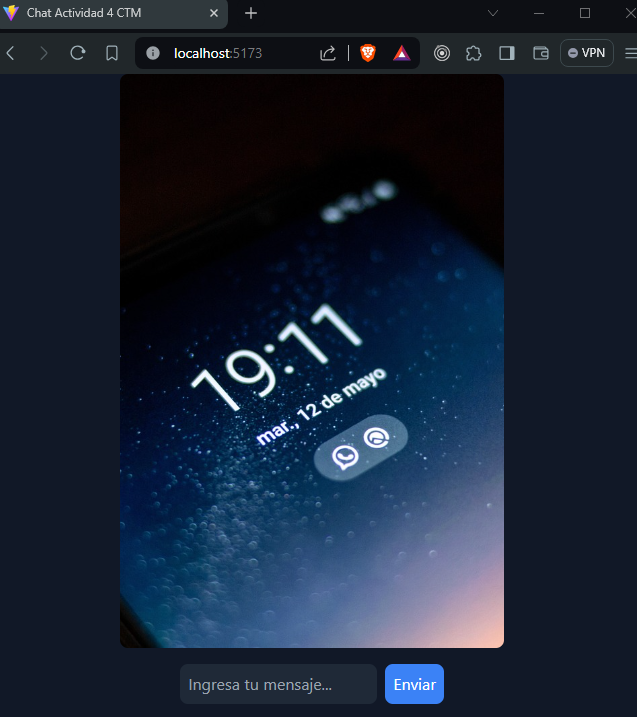
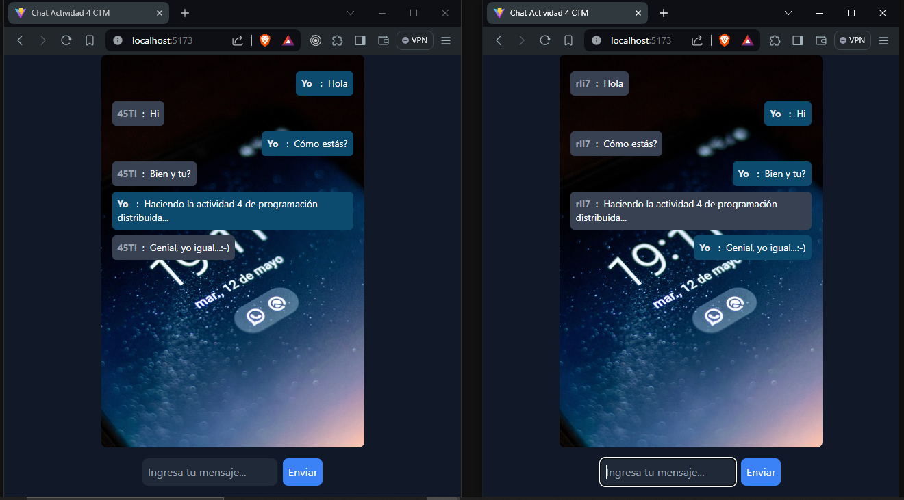

# Chat en Tiempo Real con Node.js, Socket.IO y React.js

Este proyecto consiste en el desarrollo de una aplicación de chat en tiempo real utilizando la biblioteca Socket.IO en Node.js. La aplicación permite a los usuarios enviar mensajes y recibir actualizaciones en tiempo real sin necesidad de recargar la página. Actividad realizada para la actividad 4 de la asignatura Programación Distribuida de la facultad de ingeniería en la carrera de ingeniería de software en el séptimo semestre (2024), de la Universidad de Cartagena del CTM.

## Características

- Envío de mensajes en tiempo real.
- Actualizaciones instantáneas sin recargar la página.
- Soporte para múltiples usuarios conectados simultáneamente.
- Interfaz de usuario intuitiva y fácil de usar.

## Tecnologías Utilizadas

- Node.js
- Express.js
- Socket.IO
- HTML
- CSS
- JavaScript
- React.js

## Instalación

1. Clonar el repositorio:

```bash
git clone https://github.com/rricozdev/activity_four.git
```

2. Instalar las dependencias:

```bash
cd activity_four
cd api
npm install
```

3. Ejecutar el servidor:

```bash
npm start
```

4. El servidor estará disponible en `http://localhost:3001`.

5. Instalar dependencias en el cliente:

```bash
cd client
npm install
```

Ejecutar el cliente:

```bash
npm run dev
```

## Uso

- Una vez que la aplicación esté en funcionamiento, los usuarios pueden acceder a través de un navegador web.
- Una vez dentro, podrán enviar mensajes en tiempo real y ver las actualizaciones instantáneas de otros usuarios.



Cuando ejecutes la aplicación, se abrirá la interfaz del chat en tu navegador predeterminado. Para comenzar a chatear con otros usuarios, simplemente abre otra pestaña del navegador con la misma dirección: http://localhost:5173. Esto te permitirá interactuar y chatear con diferentes usuarios simultáneamente, creando una experiencia de chat en tiempo real dinámica y colaborativa.




